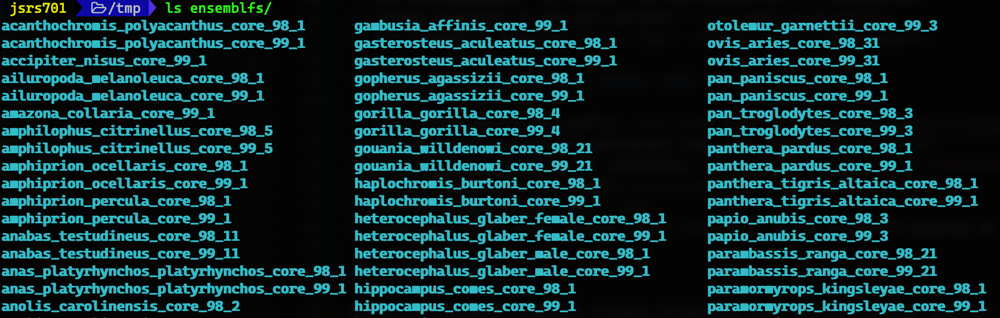

# EnsemblFS Quickstart repository

A meta-repository of all the pieces needed to get [EnsemblFS](https://github.com/stephen-riley/ensembl-fs) up and running:

* [FuseSharp](https://github.com/stephen-riley/FuseSharp.git), used to build [FUSE](https://osxfuse.github.io/) file systems in C#
* [Ensembl.NET](https://github.com/stephen-riley/ensembl-net.git), a C# library layer on Ensembl databases (like the [`Bio::Ensembl`](https://uswest.ensembl.org/info/docs/api/core/core_tutorial.html) perl library)
* [EnsemblFS](https://github.com/stephen-riley/ensembl-fs.git), the actual file system code

EnsemblFS is a [virtual file system](https://en.wikipedia.org/wiki/Virtual_file_system) that presents an [Ensembl Human Genome](http://uswest.ensembl.org/Homo_sapiens/Info/Index) database as a set of files for easier exploration.

For a quick intro to the Ensembl database structure and how EnsemblFS works with it, see [HOWITWORKS](https://github.com/stephen-riley/ensembl-fs/blob/master/HOWITWORKS.md).


## CAVEAT EMPTOR

**THIS IS VERY EXPERIMENTAL CODE.**  Please don't use this for any production use.  See `Notes`, below, for a list of issues.

## Prerequisites

*NOTE*: EnsemblFS only runs on macOS at this time.  If there is enough interest, I will port this to Linux and/or Windows.  File an issue [here](https://github.com/stephen-riley/ensembl-fs/issues) to request it.

* EnsemblFS has only been tested on macOS Catalina (10.15) but should work on Leopard (10.5) and later.
* Requires Dotnet Core 3.0.  Install the SDK from [here](https://dotnet.microsoft.com/download/dotnet-core/3.0).
* Requires Xcode Command Line Tools.  Install with `xcode-select --install`.
* Requires OSXFUSE.  Install with `brew cask install osxfuse`.
* Requires glib.  Install with `brew install glib`.
* (optional) If you want to run EnsemblFS against a local database, you'll need to download and install the Ensembl Data according to [these instructions](https://m.ensembl.org/info/docs/webcode/mirror/install/ensembl-data.html).
* (optional) Download and install [Visual Studio Code](https://code.visualstudio.com/download).  The three projects that make up EnsemblFS were all developed in VS Code and include helpful configurations that make running and debugging much simpler.

## Building and running (command line)

1. Clone this repository locally: `git clone https://github.com/stephen-riley/ensembl-fs-quickstart.git`
2. Change directory into the quickstart repo: `cd ensembl-fs-quickstart`
3. Initialize and download the submodules: `git submodule init && git submodule update`
4. Build the FuseSharp adapter library: `FuseSharp/src/Adaptor/buildadaptor`
5. Set configuration: `cp ensembl-net/etc/ensembl.conf ~/.ensembl.conf`
6. Change directory to the main project: `cd ensembl-fs/EnsemblFS`
7. Run EnsemblFS, mounting it in `/tmp`: `dotnet run -- /tmp/ensemblfs`

## Building a running (Visual Studio Code)

1. Clone this repository locally: `git clone https://github.com/stephen-riley/ensembl-fs-quickstart.git`
2. Change directory into the quickstart repo: `cd ensembl-fs-quickstart`
3. Initialize and download the submodules: `git submodule init && git submodule update`
4. Build the FuseSharp adapter library: `FuseSharp/src/Adaptor/buildadaptor`
5. Set configuration: `cp ensembl-net/etc/ensembl.conf ~/.ensembl.conf`
6. Fire up Visual Studio Code: `code .`
7. From the `Debug` menu, select `Start Debugging` to run EnsemblFS mounted at `/tmp/ensemblfs`

## Using EnsemblFS

Currently EnsemblFS supports viewing chromosome data for the selected species.  To see a list of supported species, simply execute `ls` on the EnsemblFS mount point:



The overall directory structure is as follows:

```text
ensemblfs/
    species/
        proteins/       # not yet implemented
        features/       # not yet implemented
        chromosomes/
            1/
                REF
            2/
            :
```

The `REF` files contain the actual base pair data (A, T, C, G, and N).  See the [Ensembl site](https://ensembl.org) for more information.

## Configuration

The file at `ensembl-net/etc/ensembl.conf` contains the information necessary to connect to the desired Ensembl database.  This file must be copied to `~/.ensembl.conf` (or `/etc/ensembl.conf` for a global configuration).  It defaults to connecting to one of Ensembl's US-based public databases, which contains almost 500 different versions of different species.

## Notes

* The code is built for Ensembl database version 99.  I've not tested it against version 98 schemas, so YMMV.
* Only chromosome base pair data is supported right now.
* See [this issue](https://github.com/stephen-riley/ensembl-fs/issues/1) for some notes on your Terminal configuration.  (tl;dr: Set your Terminal Scrollback setting to "Limit number of rows to: 10,000" under Profiles->Window).
* If you see `mount_osxfuse: mount point /private/tmp/ensemblfs is itself on a OSXFUSE volume`, that means you need to *unmount* the virtual file system.  Just run the `umount` command, specifying the mount point; eg. `umount /private/tmp/ensemblfs`.

## Why this exists

I've been meaning to try FUSE for a while, and recently a friend got hired at a genetics lab software company, which rekindled my interest in molecular biology and the [Human Genome Project](https://en.wikipedia.org/wiki/Human_Genome_Project).  This seemed like a fun way to combine these things.
